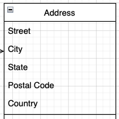
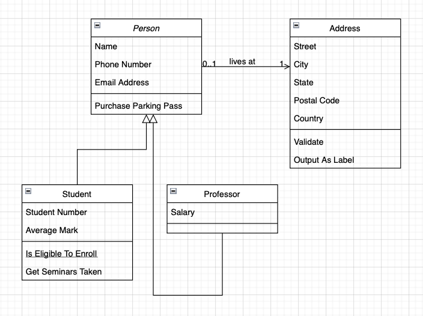

# App Planning

This pre-reading will go over three different planning activities

- User stories
- Wireframes
- ERDs (Entity Relationship Diagrams)

**Note:** If you learn new concepts better visually, here are two videos to introduce these topics.

**Second note:** Both of these videos are associated with specific tools. You do not need to use these tools, or sign up for these tools in order to watch the videos.

- [Creating Wireframes Walk-through Video](https://youtu.be/qpH7-KFWZRI)
- [ERDs](https://youtu.be/QpdhBUYk7Kk)

## Introduction

In this program, so far, you've been building apps for yourself. The apps focus has been learning fundamentals. Now it's time to shift away from that focus and, instead, focus on applications that are for other people/customers and serve some business need.

To build applications that are for users, there is some upfront, non-coding work required.

Think about the apps you enjoy using they are probably

- Easy to navigate
- Make it easy for you to do what you want to do on them
- New features are intuitive/easy to discover/easy to learn to use
- Look nice
- Have a responsive design

## Building a User-First App

### User Stories

One of the first things you can do is to write `user stories`.

User stories are a way to write about one or more features of an app in plain English. They also help non-developer teams understand the features adn can help clarify whether a feature is needed, is the feature intended and how it should ultimately work.

User stories typically follow the following (or similar) format:

```
As a <type of user>, I want to <some goal>, so that <some reason>.
```

You can add detail by making the user stories smaller/more specific.

Let's look at a few examples:

- As a customer, I want to see my account balance, so that I know whether or not I need to transfer money.
- As a school administrator, I want to be able to add new students to a school, so that I can start enrolling them into classes.
- As a premium member, I want to be able to see articles without an overwhelming number of advertisements, so that I can focus on reading.

From the lens of the user, it is clear what you can do. From a developer's perspective, it is clear what kind of features need to be built, from a business perspective it is clear what this feature solves. User stories end up being a really clear and easy tool for cross-team discussions.

### Wireframes

Wireframes are a simple sketch of your app, usually done on paper or with an app. The wireframe lays out the different components and gives their approximate size and location.

The wireframes lets all stakeholders to agree on where the information will be placed before developers begin building the interface.

Additionally, if you have thought back to previous projects, if you just started building your app before planning, you may have realized you didn't like how you had laid things out and when you went to refactor, it ended up taking a lot of time.

Typically a UX/UI (user experience, user interface) designer would create these wireframes. However, your team will create them for your app for capstone.

Each page of your app should have a wireframe. You can plan your app a little further by also associating a route with each view, for example, for the example below, you may want to note that that is the view available at `/groceries`

There are roughly three levels of wireframe

- Low fidelity - these are just a black and white sketch with almost no details
- Medium fidelity - these have more details, including styling and colors
- Mockup - this is a full-fledged design with many specific details.

For now, you are only expected to do low fidelity wireframes


This wireframe has the following elements

- A heading that has a background image (box with an x through it)
- A logo on top of the box (the circle on top of the image)
- A header that identifies what the user is looking at
- A button to add an item
- A bulleted list that represents a list (whether you keep the bullets or remove them when you style the app is not decided yet)

What happens when the user presses the add item button?

- Does a pop up appear?
- Does it take the user to a new page?
- Does the form replace the title and button and on submit revert back?
- Where does the new item appear? At the top of the list or the bottom? Or are things always sorted in a specific way?

You and your team have a lot of design decisions like this to make. Again, it is best to figure them out before coding is started.

Finally, it is fairly typical to start with a mobile view first.

Mobile views are simpler and it is usually easier to add elements when making a bigger view than to strip elements away to make a useful mobile view.

Additionally, many websites are visited first (and sometimes only) via mobile views, so having a great version of a mobile view tends to be an important priority.

## Templates

One thing to also consider when making your designs is if you would like to follow a template. That would mean that you create the 'outer' elements that will be reused on every page.

Things like the header, footer and navigation are things you often want to appear on every page.

When building your wireframes, think about building views that follow a similar pattern/style and what elements are reusable.

## ERD (Entity Relationship Diagram)

So far, you've been mostly working one data model (entity), perhaps two. For example, bookmarks and users.

The need to plan and map out these simple models and their simple relationship (a user can have many bookmarks), hasn't been crucial in being able to build your app.

However, when building a production level app there are tens, possibly hundreds of data models and their relationships can be very complex.

In order to design and debug, being able to draw out the entities and how they relate to one and other becomes a crucial tool.

### Entities

ERDs are typically simple one to two column tables. The header has the name of the table and the rows are made up of each property's name and possibly, its datatype.



Let's keep following this example and imagine this is for a school.

There are many people at a school. All of them should have a name, phone number and email address. We can imagine that multiple people can share the same address (roommates, siblings, couples), so it is reasonable to have a separate table for addresses, this case. Depending on the goals of your app, making decisions about keeping data in one table or splitting it our are important design decisions and you should be able to give a reason why you chose to set up your data in a specific way.

We can imagine that there are two types of people at a school - students and professors. Students will have grades associated with them, professors will have salaries associated with them. Two different types of data sets. In this case, we would have separate tables associated with the type of person at the school.



### Entity Relationships

One thing you may have noticed is that there are line between the entities and some other figures (arrow, numbers).

These represent the relationships between the entities.

Here is a non-exhaustive set of relationships entities may have

- zero (no line): Salaries have no relation to addresses.
- many (crows feet/fat arrow): a school has many students
- one or many (single line and crows feet/fat arrow): a class may have one or many instructors
- zero or many (0 and crows feet/fat arrow): a class may have 0 or many enrolled students
- one and only one (single lines or the number 1): a professor may have one and only one home address

In the above example students can have many classes and classes can have many students - we have referred to this when working with Postgres as `many to many` relationship.

The other kind of relationship can be thought of as instructor can teach many classes (and for simplicity, we will say only one teacher can teach a class at this school), we have referred to this as a `one to many` relationship when working with Postgres.

You will notice if you research ERDs and/or look at different online tools that the way to mark relationships can vary across apps. Choose one style when planning an app. When you plan other apps you can try different styles. When work at a job, there will be a style already chosen that you will adapt.

### API Planning

Since you are planning to build a RESTful API, you can even do a bit more planning.

When you look at the example diagram, there is a line and then some further actions like `purchase parking pass`.

You can utilize this same pattern to determine what CRUD actions your app should be able to perform (create new person, edit person, delete person). You may not need to have full CRUD for every model. For example, if you were creating a weather station and sending data back to a main hub, you wouldn't want anyone to be able to change or delete the data that the weather station has reported.

What about the action `purchase parking pass` - what would be the API route to do that?

Taking the time to build your diagrams and then generating a list of routes to create and tests can be very helpful in deciding what to work on and in what order.

## Choosing your tools

There are many tools out there and the features and pricing they have is always changing. Your primary focus is to build an app, so it's important to do very basic things that help you get set up.

Choosing a simpler tool will have the lowest learning curve, which will let you focus on the task, rather than learning the tool. If you already are familiar with a tool and have access to it, you can use it.

If you have further interest in developing your knowledge and skills on a particular tool, make sure you set up time in a way that is not blocking to your team's progress. You also have time after the project is complete.

## References

- [Use stories with Examples and a Template](https://www.atlassian.com/agile/project-management/user-stories)
- [User Stories](https://www.mountaingoatsoftware.com/agile/user-stories)
- [Creating Wireframes Walk-through Video](https://youtu.be/qpH7-KFWZRI)
- [What is an Entity Relationship Diagram](https://www.lucidchart.com/pages/er-diagrams)
