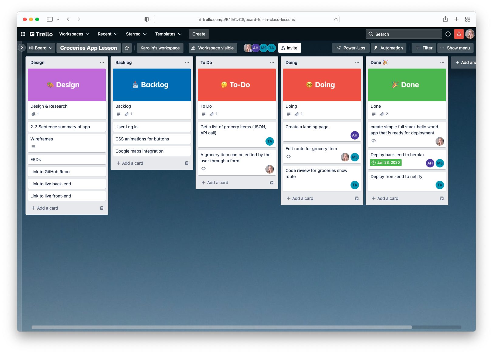

# App Planning

This pre-reading will go over three different planning activities.

- Organizing features via user stories and cards on Trello
- Wireframes
- ERDs (Entity Relationship Diagrams)

**Note:** Since there are a few new concepts that are quite visual, here are some (optional) videos to introduce these topics.

**Second note:** Both of these videos are associated with specific tools. You do not need to use these tools, or sign up for these tools in order to watch the videos.

- [Creating Wireframes Walk-through Video](https://youtu.be/qpH7-KFWZRI)
- [ERDs](https://youtu.be/QpdhBUYk7Kk)

## Introduction

So far in this program, you've been building applications primarily for yourself. Put another way, the _reason_ you may have been building particular features has been for your edification. As part of this learning process, it is normal for your creative process to be a bit chaotic.

However, it's now time to shift away from that chaotic creation and instead focus on being extremely thoughtful in how you plan your applications. It's also important to begin thinking of applications that are for expressly for other people and customers. This means keeping your user in mind, first and foremost, which may or may not be you.

Applications that you use regularly likely have entire teams of people dedicated to anticipating your wants and needs. When you think of applications that you love to use, your favorites likely have the following in common:

- They are easy to navigate
- They are reliable and sensibly organized
- They are organized in such a way that their new features are intuitive and easy to discover
- They are designed to look aesthetically pleasing
- They are responsive to different types of devices and screens

In this lesson, you'll learn a few ways that your planning process can help create this kind of experience for your users.

## Building a User-First App

### User Stories

One of the first things you can do is to write user stories.

User stories are a way to write about one or more features of an app in plain English. They also help non-developer teams understand the features that are being created and can help clarify the purpose behind a feature.

User stories are typically written in the following format:

```
As a <type of user>, I want to <some goal>, so that <some reason>.
```

You can add detail by making the user stories smaller or more specific.

Let's look at a few examples:

- As a customer, I want to see my account balance, so that I know how much money I am able to withdraw.
- As a school administrator, I want to be able to add new students to a school, so that I can start enrolling them into classes.
- As a premium member, I want to be able to see articles without an overwhelming number of advertisements, so that I can focus on reading.

From the lens of the user, it is clear what you can do. From a developer's perspective, it is clear what kind of features need to be built, from a business perspective it is clear what this feature solves. User stories end up being a really clear and easy tool for cross-team discussions.

User stories can also be a way to generate some meaningful conversations. For example, take a look at that first example again.

> - As a customer, I want to see my account balance, so that I know how much money I am able to withdraw.

When first thinking of how to address this user concern, you may just imagine needing to build a view in the application where a user can see their remaining balance. However, read that last part again: "_so that I know how much money I am able to withdraw."_ Instead of a simple balance, perhaps what the user really wants is the ability to know how much they can withdraw in a day.

Conversations like this can help you build more creative, interesting, and helpful features for your users.

### Trello

One tool that can be used for organizing these user stories is [Trello](https://trello.com/). Trello is an app that helps organize the work of big projects. Trello is made up of lists and cards. Cards should primarily be used to put individual user stories.

You will work with 5 lists:

- Design
  - This is where you should attach links to your Wireframes, ERDs and your brief description of your app - that way everyone can easily find these assets. Later, you'll put these details/assets in the README.md of your app
- Backlog
  - Start by putting all your user stories here. This is a great way to help organize what features are part of MVP (Minimum Viable Product) and what are bonus/stretch features.
- To-Do
  - These are the user stories (features) you are currently building.
- Doing
  - These are the user stories you/your team is currently (actively working on).
- Done

  - These are the completed user stories.

  

  [Getting Started with Trello Docs](https://trello.com/guide)

  [How to get started with Trello Video](https://www.youtube.com/watch?v=xky48zyL9iA)

## User Stories => Trello Cards

Convert your user stories into Trello cards. You'll likely need to revise and refine your user stories. This is a normal part of the process.

**Acceptable User Stories/Cards**

- Create a landing page
- Get a list of grocery items (JSON, API call)
- A grocery item can be edited by the user through a form

These are specific features that should be easy to check whether the functionality is there or not. They are also small features that are possible to build withing a short period of time.

**User Stories/Cards that Need Improvement**

- Users
- Full CRUD on grocery items
- Submit button for Edit one grocery item

The first one is too vague. What does users mean? What kind of functionality? What does a successful implementation look like?

The second one is also vague - is that the front-end? Back-end? Both? How many user stories are in this one card? If this is front and back-end is this a reasonable amount of work for a short period of time?

The final one is too small a task and the feature functionality is unclear. Creating a button is very small and simple. Also, does it imply the ability to edit an item?

## Wireframes

Wireframes are a simple sketch of your app, usually done on paper or with an app. The wireframe lays out the different components and gives their approximate size and location. Wireframes let all stakeholders agree on where information and visuals will be placed before developers begin building the interface.

Typically a designer or product owner would create these wireframes as opposed to a software developer. However, when building your own applications you will need to do this on your own.

Each page of your app should have a wireframe. You can plan your app a little further by also associating a route with each view.

### Types of wireframes

There are roughly three levels of wireframe:

- Low fidelity: these are just a black and white sketch with almost no details (see below)
- Medium fidelity: these have more details, including styling and colors
- Mockup: this is a full-fledged design with many specific details

For applications you are building, you are only expected to create low fidelity wireframes.

#### Low fidelity wireframe example


This wireframe has the following elements:

- A heading that has a background image (i.e. box with an x through it)
- A logo on top of the box (i.e the circle on top of the image)
- A header that identifies what the user is looking at
- A button to add an item
- A bulleted list that represents a list

This wireframe is a good start to a single page. However, consider what happens when the user presses the add item button:

- Does a pop up appear?
- Does it take the user to a new page?
- Does the form replace the title and button and on submit revert back?
- Where does the new item appear? At the top of the list or the bottom? Or are things always sorted in a specific way?

You have a lot of design decisions like this to make. Again, it is best to figure them out before coding is started.

### Templates

One thing to also consider when making your designs is if you would like to follow a template. That would mean that you create the 'outer' elements that will be reused on every page. Design elements like the header, footer and navigation are things you often want to appear on every page.

When building your wireframes, think about building views that follow a similar pattern and reuse components from one page to the next.

## ERD (Entity Relationship Diagram)

So far, you've been mostly working one or two data models, also known as entities. For example, bookmarks and users. However, when building a production level app there are tens, possibly hundreds of data models and their relationships can be very complex.

In order to design and debug, being able to draw out the entities and how they relate to one and other becomes a crucial tool.

### Entity relationships

An ERD, as the name suggests, highlights the relationship between multiple entities. This means diagramming how different tables are related in your application.

Each entity is typically represented as a visual table with a header and two columns. The header has the name of the table and each row is made up of a key-value pair where the key is the field name and the value is the data type.


For example, in the image above the following is true:

- The `courses` table has four fields: `id`, `course_name`, `start_date`, and `end_date`.
- The `students` table has five fields: `id`, `preferred_name`, `surname`, `email`, and `course_id`.
- The `courses` table and `students` table have a primary key of `id`.
- The `students` table references the `courses` table through the foreign key, `course_id`.

You will also notice that a line goes from `courses.id` to `students.course_id`. This line represents the relationship between these two entities. The three lines attaching to the `students` table are often called "crows feet" and represent a "many" relationship, whereas the single line near the `courses` table represents "one."

Put simply, this diagram shows that in this database structure it is possible for a course to have many students whereas each student can only be associated with one course.

### Complex applications

Let's keep following this example and imagine we are building an application that will track which class a student is taking and allow those students to make reviews. This application will also keep track of which instructor is assigned to which class. In order to make this application work, we'll need to make the following changes:

- We will need some way to keep track of instructors. We will assume that only one instructor will be teaching each course.
- We will need some way to keep track of reviews. Reviews will be associated with both a student and a course.

In order to make this application's database work, you may come up with the following ERD.


This ERD showcases the following:

- Courses have many students.
- Courses have many instructors.
- Courses have many reviews.
- A student can have many reviews.
- A student has only one course.
- An instructor has only one course.

In looking at these tables, did you notice some duplication? The `students` and `instructors` table is exactly the same. Creating ERDs can make it much easier to see potential duplication like this in advance, as opposed to halfway through building an application.

A refactor of this ERD could produce the following diagram.


In this ERD, students and instructors have been merged into a single table. However, that table now has a new field: `contact_role`. With this role, you could assign a number to represent students and another to represent instructors.

There are other ways you could make changes to this ERD. Ultimately, the right way depends upon the kind of queries you're making in your application as well as the general purpose of your application.

### Other relationships

There are many types of relationships besides a "one-to-many" relationship. Below is a non-exhaustive list of the kinds of relationships between tables.

- No relationship. For example, if a new table was added of `admin_users`, that table may not have any relationship to the existing tables.
- Many-to-many. For example, if you wanted `contacts` to be able to be associated with multiple courses as opposed to just one at a time.
- One and only one. For example, if you wanted a separate `addresses` table to be associated with the `contacts` table, you could set up a relationship where each contact can only have one address and each address can only have one contact.

You will notice if you research ERDs or look at different online tools that the way to mark relationships can vary across apps. You should choose one style when planning an app.

## API Planning

ERD diagrams and low fidelity wireframes are useful on their own but can also be useful for planning an API. By understanding what tables you are planning to have, you can make more thoughtful decision about your API's routes.

For example, in the most recent ERD above, there were three tables: `contacts`, `courses`, and `reviews`. You _could_ immediately plan to make CRUD routes for all of those tables. However, it would make more sense to do the following:

- First, you could look to your wireframes and see what views you are planning to create. You may find out that you actually don't need every CRUD route for every resource. For example, after a review is created, you may actually not want to allow it to be updated.
- Next, you might come up with unique routes depending on the functionality of your application. For example, you may want the ability to create multiple courses at once.

The above steps will reduce the work you have to do in the long run. While it is normal for plans to change while you're in the middle of building an application, planning in advance can save you a lot of time.

## Choosing your tools

There are many tools out there and the features and pricing they have is always changing. Your primary focus is to build an application, so it's important to do very basic things that help you get set up.

Choosing a simpler tool will have the lowest learning curve, which will let you focus on the task, rather than learning the tool. If you already are familiar with a tool and have access to it, you can use it.

If you have further interest in developing your knowledge and skills on a particular tool, make sure you set up time in a way that is not blocking to your team's progress. You also have time after the project is complete.

## References

- [Use stories with Examples and a Template](https://www.atlassian.com/agile/project-management/user-stories)
- [User Stories](https://www.mountaingoatsoftware.com/agile/user-stories)
- [Creating Wireframes Walk-through Video](https://youtu.be/qpH7-KFWZRI)
- [What is an Entity Relationship Diagram](https://www.lucidchart.com/pages/er-diagrams)
