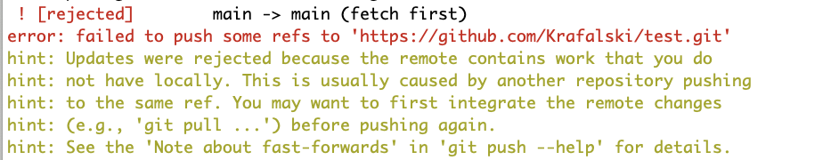
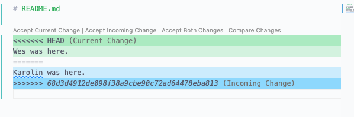

# Git and GitHub with Teams Lesson Notes

### Lesson Objectives

- Explain how git's version control allows developers to work differently on projects
- Explain what a git branch is
- Make a git branch
- Switch between branches
- Merge branches
- Resolve a merge conflict

## Guiding Questions

## In Class Activity

In this class activity:

- You will all become collaborators on a single repository
- Get a copy of the repository on your machine
- Make a change and push it directly to master
- Create a branch, make a change and push it to your branch
- Make a pull request to merge your branch into main
- Learn about why there is a `dev` branch and see a way it can be used
- Work in small groups on a shared branch, using what you learned in earlier steps
- Bring the changes from your feature back into main
- Get all the changes everyone made onto your machine

### Set Up

Together, the class will collaborate on a new repository.

**Note:** When using `<>` for commands, it means enter the specifics for you. Do not included the `<>`

Example

- `git pull origin <yourname>`

Should be typed as

- `git pull origin jane`

Context: When you have been working on activities, you typically have made a fork. A fork is your own copy of the repository that you can do whatever you would like, there may or may not be an intention to ever bring your changes back to the original repository.

If you do not make a fork, the work you do will be with the intent that it directly contributes to the original repository. Depending on the workflow/size of your team(s) at a company, you may or may not be set up with your own fork, or you may work directly with the main repo. Every job will have a somewhat different workflow that meets the needs of the teams.

Today, we will all work and contribute to the same repository without making forks.

**Instructor**

- Create a new repository on GitHub in the `joinpursuit` org so that you can add your class as a team, with a default `README.md` file
- Add all students as collaborators with `write` or `admin` permission

**Students**

- You may need to accept an invite to collaborate on the repository - please check your email
- Navigate to a folder on your computer that is not already a git repository
- Do NOT fork this repository
- `git clone <repository url>`
- `cd <repository url>`
- `touch <my_name>.md`
- `git add .`
- `git commit -m 'add <my_name> file`
- `git push origin main`

You often don't need permission to `clone` or `pull` from a public repository. However, if you want to make changes, you need to be explicitly added as a collaborator

**Instructor**

- Confirm everyone has added their file

Discuss: what are the pros and cons of collaborating in this way?

**Students**

Once everyone has added their file:

- `git pull origin main`
- confirm that you now have everyone's file

## Merge Conflict

Git figures out how to merge the code most of the them. Merge conflicts happen with then git algorithm cannot figure out which code is the newest/correct code to keep.

Merge conflicts are solvable and it's good to get some as you are learning, so you learn how to deal with them. The worst things about them is that they can, sometimes, take a long time to sort out.

Most often, will happen when people work on the same file at the same time without a plan and/or good communication.

**Instructor**

- Choose a student to make an update to the original `README.md` (a simple sentence like "Anna was here.")
- Make an update to the original `README.md` with a simple sentence
- Both should add commit and push

The person who has completed their work first should be fine.

The person with the merge conflict, should share their screen, and as a class fix it.

The steps are to:

- Choose the changes that are correct
- Add, commit
- push the changes back to GitHub

The second person will need to make a pull request and should get a `merge conflict`.



Open the file



VS code choices: accept current change, accept incoming changes...

You can also update this manually.

Remove the entire line that says

```
<<<<<<< HEAD
```

Remove the line that says (numbers will be different, corresponds to the actual commit)

```
>>>>>>> 68d3d4912de098f38a9cbe90c72ad64478eba813
```

Remove:

```
=======
```

This is to mark where one set of code ends and another begins.

Note: There can be multiple merge conflicts in one file.

Once the work is complete: git add, commit, push

## Branches

It's important to note that the `main` branch in a professional environment is usually the code that is put in production (what users interact with). If someone makes changes that breaks the code base, there will be a lot of angry people.

Git lets you create branches, which are copies that you can use and edit that are completely separate from the other branches. If you like the changes, you can mege them in. If you don't like the changes you can just switch branches and forget about it.

**Instructor**

- Make a new branch called `dev`

**Everyone**

Create a new branch and switch to it:

- `git checkout -b <your_name>`

In your markdown file, add your favorite day of the week:

```
My favorite day is Tuesday.
```

- git add, git commit...

- `git push origin main`

Why doesn't this work?

<details><summary>Hint</summary>

Even though you are on a different branch, when you push to `main` it pushes what is on the main branch locally, to the main branch on GitHub

</details>

Instead:

- `git push origin <branch_name>`

- Everyone should go to the GitHub repository page and open a pull request against the branch `dev` that the instructor has created.

**Instructor**

- Share the screen and merge about half the pull requests into `dev`
- Notice there are a few options like closing the pull request, or adding reviewers and comments. You can demonstrate how to add comments to the code for one or two students.

**Students**

Half of you had your requests merged in. But now it turns out that there is a new requirement. For the half that did not have their changes merged in:

Your sentence should now end with an exclamation mark instead of a `.`

Make the changes. Git add, commit and push again.

You don't need to make a new pull request in order for the changes to be merged in.

Once everyone's changes are merged into `dev`. Bring in the changes to your branch with

- `git pull origin dev`

You should now be able to see everyone's updates.

## Move All the Changes from `dev` to `main` and Get Them Locally

**Instructor**

Merge all the changes into main.

Why did we merge all our changes to a new branch `dev`, instead of directly into `main` (imagining that `main` is production code)?

**Students**

Get the changes to `main` into your branch by checking you are on your branch and running

- `git pull origin main`

Get the changes from `main` onto your `main` branch by

- `git checkout main` (why is the `-b` not included?)
- `git pull origin main`

## New Features

You will now be put into small groups to work on one of the following features. Each group will work on one feature:

- cool
- fun
- fresh
- exciting
- neat
- keen
- nifty
- sensational
- awesome
- super
- swell
- marvelous
- peachy

### In Breakout Rooms:

With your group - switch back to the `main` branch and make sure you have the latest version, if you haven't already:

- `git checkout main`
- `git pull origin main`

Now, make a new feature branch after the feature name you were given (everyone in your group should have the same `<feature>` name here). For example, if you are all in the `awesome` group everyone should make a branch called `awesome`

- `git checkout -b <feature>`

One group member should make a new folder called `feature`

- `mkdir <feature>`
- Move your file into this folder
- git add, git commit
- `git push origin <feature>`

The rest of the members should now

- `git pull origin <feature>`

To bring in the changes.

The rest of the group members should now move their files into this folder.

- git add, commit
- `git pull origin <feature>`
- `git push origin <feature>`

Make sure everyone's files are in the correct folder.

Once everyone is done do this one more time:

- `git pull origin <feature>`
- `git push origin <feature>`

It's ok if there are no changes, you can run `push` and `pull` as many times as you like.

Choose one person to open a pull request against `dev` with your `<feature>`

## Main Group Reassemble

**Instructor**

Review the new pull requests and merge them into `dev`

Once everyone has made their pull requests and everything looks in order, merge the changes into `main`

**Students**

Merge the changes from main into your feature branch. While you are still on your feature branch (you can check by typing `git branch`)

- `git pull origin main`

Finally, checkout to main

- `git checkout main`

And lastly, pull in the latest changes from GitHub's main branch to yours

- `git pull origin main`

Learning to collaborate with git and GitHub takes time and practice. Think about what you want to accomplish, what you expect to happen and check if it happened. If it didn't happen take some time to understand why and then try again.
