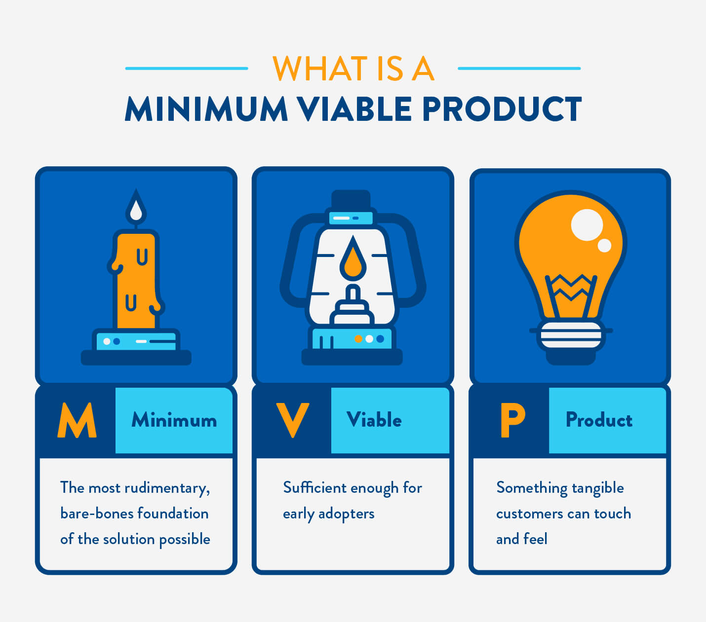

# Ideation

## Introduction

So far, you've been learning how to code, with the goal of landing a job as a software engineer. But engineers work on teams made up of managers, designers, data scientists, and more. And, furthermore, engineering teams will collaborate with other teams like those in marketing and sales.

In this module, you'll be building your biggest app yet. To build such an app, you'll have to learn some basics about the entire application development process, continue to grow your collaboration skills, and learn how to teach yourself what you need in order to fulfill your vision.

## The Vision Comes Before The Skills

It may be tempting to think about what you know how to do and then build an app around the skills you have. This is very limiting and likely won't produce very good results.

Once you have programming fundamentals, your role as a developer will always be to learn what you need in order fulfill a vision. A career as a developer is one of life-long learning. Learning how to learn and learning how you learn best on your own will be a key part of this module.

> It's been really interesting because there have been some things that when I dreamed it up, I wasn't technically good enough to figure out how to implement (animating svg paths on scroll, for example, I dreamed that up a year before I actually was able to implement it). But as time went and I worked on other things for fun, I would eventually learn enough to implement it.
> 
> \- Shirley Wu

> I started with a design vision, then worked backwards to figure out how to achieve it.
> 
> \- Tony Chu

> I was introduced to D3 by first drawing a smiley face with just SVG... From then on everything I was learning was driven by "I want to do X... now how do I do that?"
> 
> \- Zan Armstrong

All of these quotes are from the article [How do you learn d3.js?](https://medium.com/@enjalot/how-do-you-learn-d3-js-ccffc151419b)

So for now, put aside your coding skills and let's shift to creating a great app idea. Because you are ready to build anything!

## Ideas vs Ideation

You have ideas all the time. Ideas about what to eat for lunch, what you want to do when you see your friends, how to stop a door from being squeaky etc. Ideation is a more formal way of coming up with ideas.

## Inspiration Versus Ideation

We often hear success stories of someone just sitting in the park when they are struck with a really great idea. We tend to love and celebrate these stories, however, they tend to be the exception and also not the full story of how the idea came about.

Most great ideas come from practicing the skill of brainstorming and spending scheduled time being creative, either on your own or with a group. There are actually some great processes that have been developed that you can learn and apply so you can start developing app ideas.

Before we get started, let's be sure we understand some key terms and get a better sense of the big picture.

## The Economy and Industries

The economy has many components to it, one of the components is a collection of industries.

There are four types of industry:

- Primary: gathering of raw materials, such as agriculture, fishing, mining
- Secondary: manufacturing, such as making microchips, steel, cars, laptops
- Tertiary: service, such as teaching, nursing
- Quaternary - intellectual and research and development, such as information-sharing, entertainment

[A list of industries](https://www.ilo.org/global/industries-and-sectors/lang--en/index.htm)

As technology advances, the number of jobs in each type of industry tends to change. For example, thanks to the technology of E-ZPass in New York, the number of toll-booth workers declined, but the number of tech workers who maintain and update the system has increased.

What industries have you worked in? What kind of technology did you use when you worked in that industry? What kind of technology did you wish your place of employment had? If you haven't worked yet and have only been in school, you can think about the experience of yourself and your teachers.

Lastly, it's important to remember that the economy is about people.

## The Steps of Product Ideation

Now that we have an idea of how far reaching technology is across the economy, we can start to put all the pieces together of coming up with a great idea.

The tech you will be building for your capstone will have some sort of user-interface. Even if you come up with an idea for a touchscreen app for a microwave, you'll still build it as a web app, in order to demonstrate the idea.

### Observation

Take some time to think about your everyday life that could be improved, simplified, or more enjoyable. Perhaps you've had conversations with friends or family about certain products and their features.

Perhaps you have some interests, like deep sea fishing. Although you don't intend to go deep sea fishing, you like to read about it and watch programs about it. Perhaps there are problems that the deep sea fisherman have that you can think of a way to assist with.

Be sure to capture as many of these ideas as possible, no matter how small, whether or not they are related to tech. At this point you are just gathering all the ideas.

### Customer Personas

Not every product is going to be made for everyone. There are specialized baby products that many adults have no use for. The needs of a young couple is different than that of an old person living on their own.

And perhaps the problem that you identified that was most interesting to you was not something for you. Perhaps, you are not fond of dogs but, your friend has a dog walking business and they have trouble figuring out how to best schedule their time. Perhaps, you don't have a lawnmower yourself, but you saw a news report that 70% of lawnmower owners forget to service their machines on a regular schedule.

Once you have your initial set of ideas from observation, think about who would benefit from your idea. You should now be able to narrow all the ideas you had into a smaller number of ideas that have greater potential to become a business idea.

As you think of specific users your idea will become clearer and more robust.

### Visualizing Your Idea

What will your idea look like? Is it a phone app? Is it a web site? When will your customers interact with it? At home? At work?

Think of similar apps and what you like or don't like about them.

By now, you should have chosen one idea to follow through with the next steps

### Determine MVP

MVP stands for Minimum Viable Product. This is a product with the least amount of features needed to validate a product idea.

For example, with an online store, you may build a shopping cart, but not fully integrate actual ways to pay/place orders. It is enough to demonstrate how your app works, and those additional features would be added later in the development process.

A real world example is eBay. When eBay first started people were in charge of paying each other, either by check, money order or sending cash in the mail. Later, eBay integrated a unified payment system.

When you plan for capstone, your instructor will help you narrow down your idea to something that is possible to build within the time-frame you have.

### Plan Your Design

Creating a complex application takes planning and strategy. It's also important to have a clear vision of what you are building. If you aren't sure what you are trying to build, it won't be possible to succeed. Learning to plan and execute on an idea is critical to success.

Before beginning a project make sure you can answer:

- A brief summary of the idea
- Which industry does this app belong to?
- Who is this product for (customer persona)?
- What problem does it solve?
- Why is this problem important?
- What are the customers doing to currently solve the problem?
- How does it compare to the alternatives?
- What tasks does the app perform in order to solve the problem?
- What are the expected outcomes?
- Will this app be
  - A totally new idea (e.g. solves a problem for people living on Mars)
  - An extension/new feature of an existing product/app (Uber does [last-mile](https://en.wikipedia.org/wiki/Last_mile_(transportation)) deliveries for prescriptions)
  - A new version of an app that already exists, but is significantly different (compare/contrast MySpace to FaceBook)
  - Other (make sure you can clearly explain, if it is other)

Now that you've gotten an idea that you are interested in building out, you would take the time to make user stories, wireframes and ERDs. It's ok if you don't remember what these are or perhaps have learned about them yet. We will go over them in a later lesson.

### An Example

There is a new food craze: soup for lunch. Unfortunately, canned soup doesn't have a lot of variety, buying soup from a restaurant every day is too expensive and many people are too busy to figure out how to make their own soup. Most people need help with getting simple recipes they could make and start enjoying soup!

- The industry this belongs to is the Service industry.
- This product is mostly for busy individuals who work somewhere where there is a microwave that they can use to heat up their lunch.
- This solves the problem of helping people make their own soup.
- People want to eat better and soup is a healthy choice. Helping make soup become easier to make will help people eat better.
- Customers are either buying canned soup or spending too much on take out or making the same boring soup over and over again.
- I searched the internet and I didn't find any similar alternatives to a soup building app.
- The app will have a list of 'classic' soups, but then also have a guide for people to choose their preferences (meat, vegetarian, vegan, spicy, etc), and then walk them through creating their own custom soups based on their choices.
- The expected outcome is that more people start enjoying soup for lunch.
- This app is a new idea, but could be an extended feature of one of those app that does grocery delivery. For now it's just going to generate a list of ingredients based on user preferences.

## Research

Typically, before hiring a team of people and having them spend hundreds or thousands of hours building something, extensive research would be done. This is a separate field from software engineering.

For capstone, you will just use your own experiences to be the driver of building your idea.

## Further Reading

- [What is the economy?](https://www.ecnmy.org/learn/)
- [Industries and Sectors](https://www.ilo.org/global/industries-and-sectors/lang--en/index.htm)
- [The five steps of product design](https://www.beyonddesignchicago.com/the-5-steps-of-product-design-ideation/)
- [What does it take to build the right product](https://www.linkedin.com/pulse/what-does-take-build-right-product-meghna-rao-g/)
- [Minimum Viable Product](https://clevertap.com/blog/minimum-viable-product/)
- [Without a Foundation of Research, Product Development Falls Apart](https://distillery.com/blog/without-a-foundation-of-research-product-development-falls-apart/)

- [Y Combinator Startup Expo 2020](https://www.workatastartup.com/events/startup-career-expo-s20)
