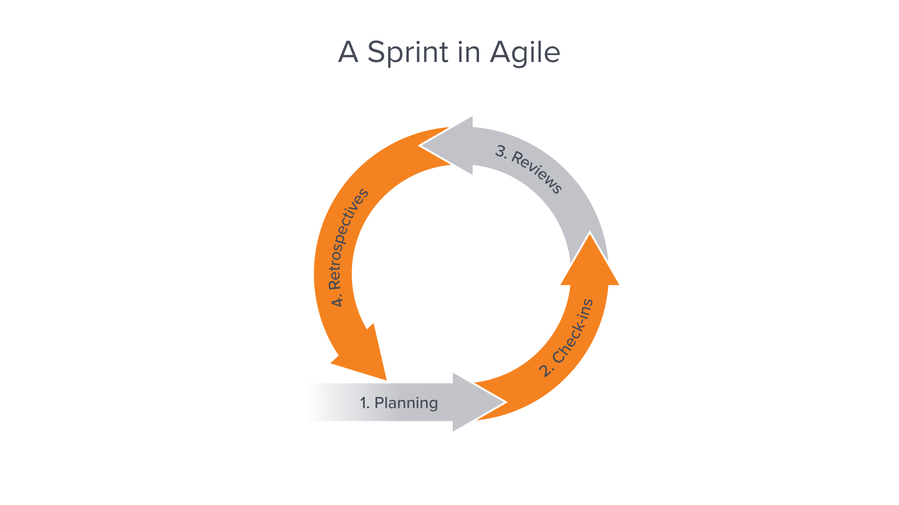

# Software Development with Teams

The best apps are made by large teams. But working with others, and especially coding with others can be really challenging. Often, the ability to work with others is a skill that is taken for granted or glossed over. There is often an expectation that people should just figure out how to do it on their own. But this doesn't have to be the case.

There is a separate discipline of project management that can take a lot of study and practice that teaches people how to manage projects and teams for the best results.

We're going to learn some basics about project management to assist you with your capstone project.

In the diagram below, planning is the first step. You've been introduced to user stories, wireframes and ERDs, which are all part of a planning phase. Let's complete what we need to learn for planning and then learn about the other phases and how we'll apply them to the capstone project.

[Image Reference](https://www.workfront.com/project-management/methodologies/scrum/sprints)

## Background and Mindset

Building software comes with unique challenges, in particular: Continuous learning. Ideas and plans that seemed good/workable at the start often need to be adjusted as projects develop.

A lot of old management styles were not working for software development. Therefore, a new way of management came about that was called Agile in the early 2000s. Since then several variations have been created and each company will have their own systems, but generally, there are a few core principals that are always present.

[Here are the core principles in the Agile Manifesto](https://agilemanifesto.org) and [The Twelve Principles of Agile Software](https://agilemanifesto.org/principles.html)

Let's see how these principles can impact how projects are built. Let's focus, in particular, how you can use them for your capstone project:

- Meet with your group often and talk things through
- Projects require motivated individuals that are supported and trusted

  - Regular reflection and fine-tuning adapting behavior
  - Working on software and working on teams is hard. Each team will have a unique skill set and a unique work dynamic. Learning to work with your team takes time and effort. Keep adapting to make the most of your team's skills and abilities.

- Early and continuous delivery of software (MVP)
  - Plan your app well enough that you deliver MVP as soon as possible
- Welcome changing requirements
  - As you build, different features may become unimportant and other features may end up becoming critical. Be open to adapting when needed
- Frequent delivery of working software

  - Rather than aiming for a large "complete" project on the final day of capstone, every day/week new working (small) features should be delivered by every teammate
  - Take a moment to celebrate each victory and recognize your progress. There is always more to do, but don't let that take away from your team's progress.

- Sustainable progress, new features should be able to be added indefinitely
  - It should be possible to keep adding new features to your app. A new feature should not require a full rewrite of the app. Use best practices that you've learned in class to keep this possibility open. This will likely be one of the hardest thing to do as a team, it takes practice and a lot of learning from mistakes
- Maximizing the work not done is essential
  - Everyone wants to do a great job. It can feel like saying "yes" to all the ideas is the way to achieve greatness. But focusing on the the most critical features and learning to say "no" to distractions will help you build each component really well and give you a strong foundation to build on top of, if/when the time comes.

Zoom best practices:

- Turn your camera on, unless you are sick. If you will not be turning your camera on, inform your teammate(s)
- Keep the meetings short and on point
- But also, take a moment to check-in on how everyone is feeling/doing

## Sprints

You will work in several sprints over the next few weeks. A sprint is a process of planning the work for a short period of time. At the end of each sprint, you will look at the work completed and the work not completed and make a new sprint (plan) that adapts to where your team and app is at.

Every company does sprints differently. Even within Agile there are a few variations.

For class, your sprints will be about once a week. You will also be combining reviews (see below) and sprints. Often, these are held as separate sessions.

## Check-ins

Daily check-ins are often referred to as `Stand-ups` the idea is that if everyone would be required to stand, the meetings would be shorter and people would be more focused on the core goal(s) of the meeting.

Typically, the following questions are asked:

- What did you work on yesterday?
- What will you work on today?
- What blockers are in your way?

If there is a bigger issue to discuss ("I don't think we should build X feature any more, we should do Y") - set a separate meeting time.

If someone is blocked because they are not sure what to work on, talk out it out if it is quick. If it will take longer, schedule a separate meeting.

If someone is blocked because they are stuck with their code, figure out a plan to get unblocked (outside of this meeting time):

- Talk it out with another group member (after the meeting)
- Do some pair programming
- Ask an instructor for guidance

A good idea is to screen-share the Trello board and move the cards as a group. This can help clarify the work that is happening with different members.

## Reviews (Stand Downs)

About once a week, you will hold a longer meeting (30-60 minutes) to go over the work that was done in more depth, review how the team is doing and make plans based on the progress that has been made.

This should be a safe space to allow people to be honest about how it's going and to find constructive ways to make things better.

Things to cover:

- Accomplishments (~5 minutes)
- The things that went well (~5 minutes)
- The things that didn't go well (~5 minutes)
- The things that can be done better (~10 minutes)
- Improving communication/adapting the use of Trello (~5 minutes)
- What is everyone working on next, updating the Trello board (~10 minutes)

The following roles should rotate for capstone:

- One person should run the meeting (ask the questions, make sure everyone answers), make sure that the group stays on topic and after the meeting, sets up follow up meetings, as needed
- One person should take notes
- One person should update the Trello board
- One person should watch the time and make sure the meeting does not run over

Further tips:

- Keep it positive/constructive
- Don't make it personal/don't take it personally
- Allow everyone to speak without interruptions
- Stay on topic

## Retrospectives

At the end of the module, you will get a chance to reflect on the capstone project.

## Background Reading

[The Secret Startup That Saved the Worst Website in America](https://www.theatlantic.com/technology/archive/2015/07/the-secret-startup-saved-healthcare-gov-the-worst-website-in-america/397784/)

## References

- [What is Agile](https://www.workfront.com/project-management/methodologies/scrum/sprints)
- [Sprint Retrospective](https://plan.io/blog/sprint-retrospective/)
