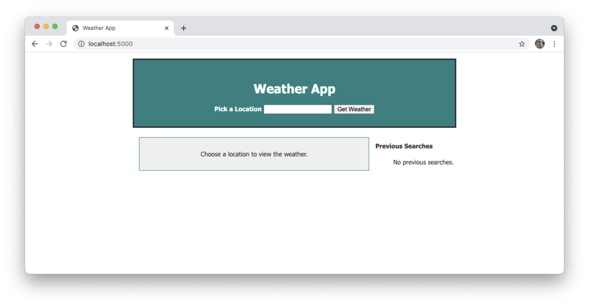
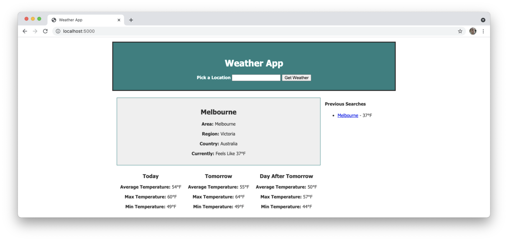
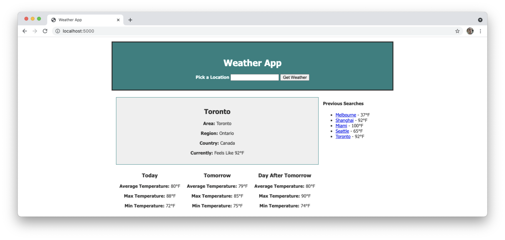
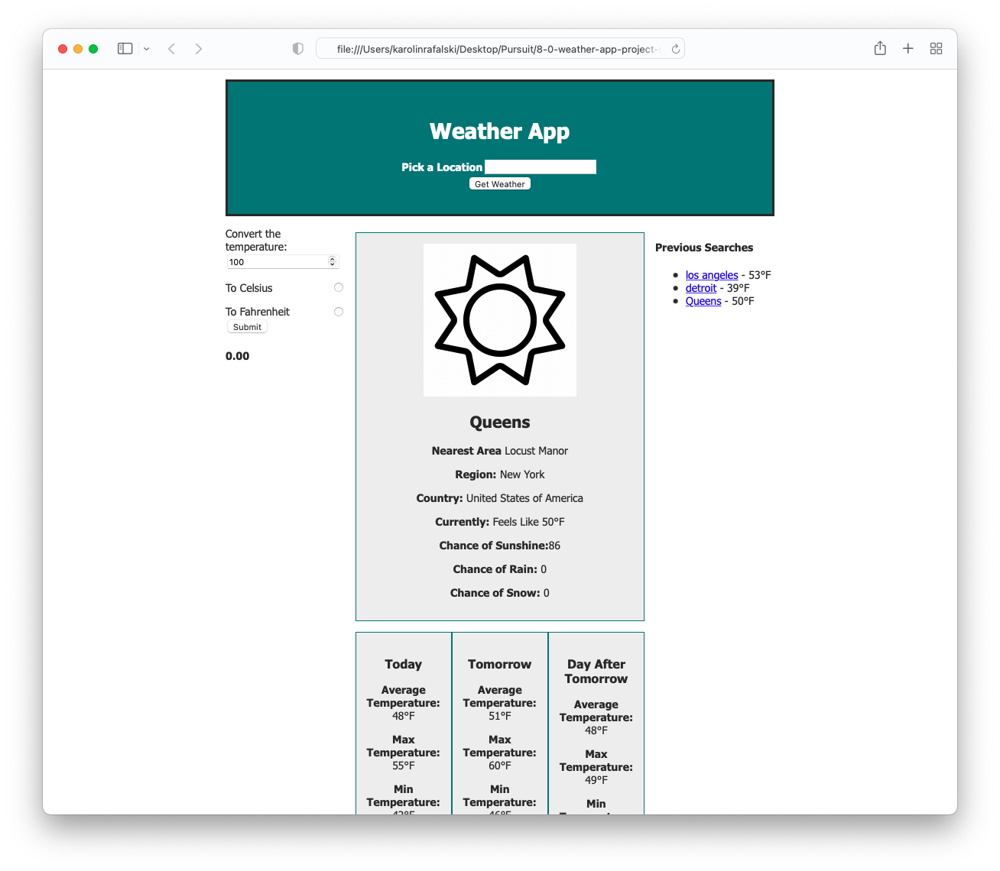

# Take Home Challenge 1 Lesson Notes

## Learning Objectives

- Understand what a take home challenge is and what level of work is required for it
- Explain the steps you should take for a take home challenge
- Understand why each step is critical for your success
- Be able to name some common mistakes

## Guiding Questions

- How do you compare to other candidates if you do the bare minimum?
- What is the issue with going way above and beyond with the required specs?
- If you want your app to stand out, what are the best things you can do?
- What are some challenges you've faced with previous labs/assignments and how can you learn from those challenges?

## In Class Activities

## Activity A

**Prompt:** Build a weather app using the [Open Weather API](https://openweathermap.org/api). Submit within 3 days of receipt of this prompt by providing a zip file.

Build a landing page that has a text input and submit button for a location.

After submitting a location, it should show a component with the location and current weather.

In addition it should have weather for today, tomorrow and the day after tomorrow.

Finally, there should be a list of previous searches

After multiple searches the page should update to look like this:

Stretch features

- Create a temperature converter widget
- Add icons for the weather conditions
- Show more details about the current weather

Type out over slack sample email text you would submit to an an interviewer about 1-2 clarifications about what is required.

Discuss as a class

## Activity B

Everyone should read the take-home challenge prompt.

Fellows should be given some time to ask clarifying questions as a class.
